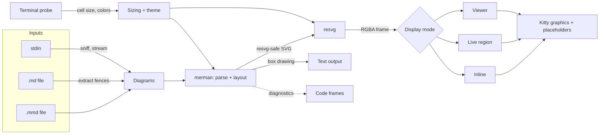

# mer — design

> How `mer` is built, and why. The original proposal, with ideas that were not built, is in the
> history at fe0604d.

`mer` renders Mermaid diagrams as real graphics inside the terminal:

```sh
mer flow.mmd              # inline, sized to the terminal's text
mer README.md             # every mermaid block in a Markdown file
cat flow.mmd | mer -      # stdin, shown live while it keeps arriving
mer -w flow.mmd           # redraw when the file changes
mer -i big.mmd            # full-screen viewer to pan and zoom
```

It is one Rust binary without a browser or Node.js. merman parses and lays out the diagram,
resvg draws the SVG with an embedded Inter font, and the kitty graphics protocol puts the pixels
on screen. Terminals without the protocol get merman's box-drawing rendering instead.



## 1. Choosing the Mermaid engine

Mermaid.js measures text with a browser, so the official CLI (`mmdc`) drives headless Chrome. The
candidates were benchmarked with four samples (a flowchart with a subgraph, and a sequence, a
class and a state diagram) and their output compared with `mmdc` by eye. Whole-process wall time,
median of 15 runs:

| Engine | How it works | SVG | PNG | Output vs `mmdc` |
|---|---|---|---|---|
| `mmdc` 11.12 | mermaid.js in headless Chrome | — | 1.2–1.7 s (2×) | Reference |
| mmdr 0.3.1 | Independent Rust re-implementation | 3–4 ms (67 ms flowchart) | 16–87 ms (1×) | Wrong on common syntax: `R --> X[label] --> P` became a node named `X[Extract` and lost an edge; generics weren't converted; edges ran through nodes |
| **merman 0.8.0-alpha.6** | Rust port validated against mermaid@11.17.2 fixtures | 12–14 ms | 34–48 ms (2×) | Near-identical layout on all four; class-relation markers filled instead of hollow |

Also surveyed: beautiful-mermaid (TypeScript, six diagram types, its own style), mmdflux and
mermaid-text (box-drawing output only), and Markdown viewers that shell out to `mmdc`.

merman also fits well as a library. Its resvg-safe pipeline turns HTML labels into SVG text, a
`TextMeasurer` trait lets `mer` measure labels with the font it draws with, `OperationControl`
cancels renders, and it has a Unicode renderer and diagnostics with source spans. It is pre-1.0,
so the version is pinned exactly and only `src/engine/` uses it.

## 2. Architecture

One crate, no async runtime.

```text
src/
  main.rs        mode dispatch, --check, -o export
  cli.rs         command line (clap)
  settings.rs    flags over config.toml over defaults
  input/         files, Markdown fences, stdin sniffing, -n selection
  engine/        merman: SVG and text rendering, label batching, Inter measurement
  fonts.rs       the embedded Inter faces
  render.rs      one diagram to one frame: SVG, then pixels covering whole cells
  raster.rs      resvg, straight alpha
  size.rs        text-matched scale and fitting
  theme.rs       colors, and the Mermaid theme derived from the terminal's
  display.rs     Setup (probe, theme, background), one-shot output, --doctor
  diag.rs        code frames
  term/          /dev/tty, capability probe, input decoder, kitty encoding, tmux passthrough
  live/          render worker, live region; the stream, watch and viewer modes
```

Live modes run these threads, which all send messages to the main loop:

- **Main loop.** Owns all terminal output. It sleeps until a message arrives or its next deadline
  passes: a stream preview, or colors settling after a light/dark switch.
- **Input.** Reads `/dev/tty` and decodes keys, mouse events and terminal reports.
- **Signals.** Forwards SIGINT, SIGTERM and SIGHUP, which quit, and SIGWINCH, which resizes.
- **Render worker.** Runs one job at a time. The main loop sends the next job only once the
  previous result is back, so changes made during a render are drawn together by the next one.
  Quitting cancels the render in progress, and so does switching diagrams in the viewer. New
  content does not: while input keeps changing, a slow diagram would otherwise never be shown.
- **stdin reader** for streams, and **file poller** for watching.

## 3. Input

**Files.** `.mmd` and `.mermaid` files hold one diagram. `.md`, `.markdown` and `.mdx` files yield
every `mermaid` fence in order, captioned with the nearest heading above it. Other files are
sniffed like stdin. `-n N` keeps the Nth diagram of each input, also when watch and the viewer
read the files again.

**Markdown.** A line-based scanner rather than a CommonMark parser, so the same code serves files
and streams. It handles backtick and tilde fences, longer fences containing shorter ones,
indented fences and `{mermaid}` info strings. A fence left open runs to the end. Line numbers are
kept so diagnostics point into the Markdown file.

**stdin.** `-` reads stdin, and so does `mer` without inputs when stdin is not a terminal. Keys
and terminal replies always come from `/dev/tty`, so `cat f | mer -` still works in live modes.
The format is decided at the first meaningful line, skipping blank lines, `%%` comments and a
leading `---` frontmatter block:

- A Mermaid header or a `%%{init}%%` directive means Mermaid. Distinctive headers such as
  `sequenceDiagram` match by prefix. Ordinary words such as `pie` or `graph` must stand alone,
  apart from their options, so prose like "pie charts are…" is not a diagram.
- Anything else is Markdown.
- `--stdin-format` overrides the detection. NUL bytes separate documents.

**Streams.**

| Input | Behavior |
|---|---|
| Ends within 400 ms without an 80 ms pause | Read to the end and drawn once, exactly like a file |
| Mermaid that keeps arriving | Once input pauses for 80 ms, the complete lines are previewed in the live region. Errors only change the status line. At the end, the final picture is printed like one-shot output and errors are reported |
| Markdown that keeps arriving | Each diagram is printed as soon as its fence closes |

**Watch.** Files are polled for size and modification time every 150 ms, which also catches
editors that save by renaming. The picture redraws in place, and syntax errors appear under the
last good picture.

## 4. Rendering

**Engine.** `Engine::render_svg` uses merman's resvg-safe pipeline, and `Engine::render_text` its
Unicode renderer.

- Configuration, lowest precedence first: the theme and the embedded font, the `[mermaid]` table
  of the configuration file, `-c FILE`, then frontmatter and directives inside the diagram.
- merman's default resource budgets are meant for untrusted input and reject schemas of a few
  hundred tables. `mer` uses merman's profile for trusted input, which keeps its hard limits.
- Mermaid's white root background is replaced by the chosen one, transparent by default.

**Label batches.** Most diagram types put labels in HTML inside `<foreignObject>`, which resvg
can't draw, and merman converts them to SVG text.

- The conversion matches CSS within a budget that is a constant in merman
  (`MAX_SELECTOR_MATCH_WORK`). About a thousand labels use it up, so an ER diagram of 30 tables
  would fail.
- `engine/labels.rs` runs first and gives the converter 256 labels at a time, in a document with
  only those labels, their ancestors and the stylesheets. Labels with expensive styles get
  smaller batches. Documents with `<switch>` elements are left to merman.
- A test renders every gallery diagram both ways and compares the SVG. The module can go once
  merman's budget is configurable.

**Text measurement.** merman's deterministic measurer reproduces browser measurements in detail,
but assumes Mermaid's default fonts.

- `mer` wraps it and scales only its widths, by the ratio of Inter's width to the measurer's for
  the same text.
- Inter's width is shaped with harfrust, as resvg does. Wrapping, overhangs and heights stay
  merman's.
- Ratios are cached by text, size and face.

**Font.** Inter's Regular, Italic, Bold and BoldItalic faces (SIL OFL 1.1) are compiled in, and
are the only fonts loaded unless a diagram contains characters Inter lacks, such as CJK or emoji.

**Sizing.**

1. The cell size in pixels comes from `CSI 16 t`, or else from the pixel size in `TIOCGWINSZ` or
   `CSI 14 t` divided by the grid.
2. The text-matched scale is `cell_h / (1.3 × 16)`, at which Mermaid's 16 px labels come out the
   size of the terminal's text. `--scale` multiplies it.
3. Fitting: `width` shrinks diagrams to the terminal width and lets tall ones scroll, `contain`
   also fits the height (live modes use it), and `none` keeps the size.
4. Frames cover whole cells, so the terminal never resamples them. Inline frames are capped at
   16 megapixels, and at 297 cells each way, the rows and columns placeholders can address.

**Theme.**

- The `terminal` theme, the default when displaying, fills Mermaid's `base` theme with about 170
  variables. They are derived from the terminal's foreground, background and ANSI colors 1–6
  (OSC 10, 11 and 4). One Dark or One Light colors stand in for ANSI colors the terminal doesn't
  report.
- The theme is dark when the background's luminance is below 0.2. Categorical colors (pie slices,
  git branches, sections) follow the ANSI palette. Packet diagrams take colors from their
  configuration section. C4 diagrams keep Mermaid's fixed colors.
- Live modes enable color-scheme reports (mode 2031). After a light/dark switch they query the
  colors again and re-render once the replies settle, after 150 ms.
- `-t` selects a Mermaid theme instead. Exports use `default` on white unless `-t`, `-b` or the
  configuration say otherwise.

**Rasterization.**

- usvg parses the SVG with the embedded fonts. `resvg::render` draws through a scale-and-translate
  transform, so the viewer renders any viewport at any zoom without a full-size intermediate.
- tiny-skia pixmaps are premultiplied, while the kitty protocol expects straight alpha. The
  conversion runs in place and touches only partly transparent pixels, which matters because
  most of a frame is transparent.

## 5. Terminal

**Probe.**

- `mer` writes every query to `/dev/tty` at once, followed by DA1. The queries are:
  - the kitty graphics query (`a=q`);
  - `CSI 16 t` and `CSI 14 t`;
  - OSC 10, 11 and 4 color queries;
  - `CSI ? 996 n`.
- Every terminal answers DA1, so its reply ends the probe and no query has to time out. A 500 ms
  safety timeout covers terminals that don't answer; `MER_PROBE_TIMEOUT_MS` changes it.
- tmux answers DA1 itself, ahead of the replies it forwards, so inside tmux the probe waits up to
  250 ms more for the graphics reply.
- Replies are decoded by the same decoder as keys in live modes. `mer --doctor` prints the
  results.

**Kitty graphics.**

- Images use virtual placements and Unicode placeholders. Pixels are transmitted with `a=T,U=1`,
  then a grid of `U+10EEEE` cells marks where the image appears. Each cell carries its row and
  column as diacritics and the image id as its foreground color.
- To the terminal the image is text: it scrolls, stays in the scrollback and survives redraws.
- Transmission is direct: zlib-compressed RGBA in base64, in 4096-byte chunks, with replies
  suppressed. Updates use synchronized output (mode 2026).
- Image ids are random 24-bit numbers, so they don't collide with other programs' images. Inside
  tmux they have 8 bits and are encoded as palette colors, which tmux passes through intact.

**Display modes.**

- **Inline.** Each diagram prints its caption, image and placeholder grid, and stays in the
  scrollback. A diagram that fails prints its code frame, and the others still render.
- **Live region.** Used by streams and watch: lines at the bottom of the output are redrawn in
  place (`CSI F`, `CSI J`) with the picture, notes and a status line. Finished output is printed
  above the region and scrolls into the history.
- **Viewer.** The alternate screen, with SGR pixel mouse reports (modes 1002, 1006 and 1016) and a
  grabbing pointer while dragging (OSC 22). Each diagram's SVG tree is cached, and a change of
  view rasterizes only the viewport. While the viewport keeps its size, frames are sent under the
  image id already on screen, and the placeholder grid is not drawn again. Inside tmux, pointer
  positions arrive in cells, and the middle of the cell stands in for the pixel.

**tmux.** Graphics sequences are wrapped in `ESC P tmux; … ESC \` with doubled escapes. That
needs `set -g allow-passthrough on`, and `mer` gives that hint when the probe inside tmux finds no
graphics.

**Text.**

- Without kitty graphics, or with `--protocol text`, merman's Unicode renderer draws the diagrams.
- A drawing wider than the terminal is an error, because wrapped lines garble it and merman's
  fallback for drawings that don't fit lists its internal model. Output to a pipe or a file has
  no width limit.
- Live modes and the viewer need images.

**Restoring the terminal.** Raw mode, the live session and the viewer each undo their changes when
dropped: on exit, on errors, and when a panic unwinds. SIGINT, SIGTERM and SIGHUP end live modes
the same way `q` does, with exit code 130.

## 6. Diagnostics and configuration

Parse errors are printed as code frames, with positions shifted from the fence to the file:

```text
error: Unterminated node label (missing `]`)
  --> docs/arch.md:44:15
   |
44 |   B -->|yes| C[Done
   |               ^
```

- `mer --check FILES…` renders every diagram to SVG without displaying it, and exits 1 on errors,
  for pre-commit hooks and CI.
- Exit codes: `0` success, `1` diagram errors or no diagram found, `2` usage, I/O or terminal
  errors, `130` a live mode interrupted by a signal or Ctrl-C.
- `~/.config/mer/config.toml` sets `theme`, `background`, `scale`, `fit`, `protocol` and a
  `[mermaid]` table. `$XDG_CONFIG_HOME` or `MER_CONFIG` can point elsewhere, and flags override
  the file. The README lists every flag.

## 7. Testing

- **Unit tests** cover:
  - the kitty encoder byte for byte, placeholder diacritics and tmux wrapping;
  - sizing, theme colors, fence extraction and sniffing;
  - the input decoder and probe replies;
  - code frames and settings precedence;
  - label batches against merman's own conversion.
- **End-to-end tests** run `mer` on a pseudo-terminal that answers queries like Ghostty, a light
  terminal or a terminal without graphics. They decode the images and placeholder grids it
  writes. They cover:
  - files, Markdown, stdin and streams;
  - watch and the viewer;
  - text output, export, `--check` and configuration;
  - a real tmux when it is installed.
- `cargo test --test e2e gallery -- --ignored` writes contact sheets of every diagram type on a
  dark and a light terminal, for checking themes by eye.

## 8. Performance

Release build, from process start to exit on a pseudo-terminal with the probe answered:

| Diagram | Time |
|---|---|
| State | 13 ms |
| Class | 19 ms |
| Sequence | 22 ms |
| Flowchart (the sample with a subgraph) | 23 ms |

- **Without a terminal.** `mer --check` exits in about 2 ms when the input holds no diagram, and
  takes about 7 ms for the state diagram and 9 ms for the flowchart. Building the engine costs
  under 2 ms of that.
- **Viewer frames.** A full-screen frame on a 5K display is 5100 × 2856 pixels, or 55 MB of RGBA.
  The layout takes 6–10 ms the first time the diagram is shown. Rasterizing takes 19–21 ms, and
  compressing to 550 KB takes 7–8 ms. `cargo test --release frame_costs -- --ignored
  --nocapture` measures this.
- **Transport.** Encoding is not the bottleneck, which is why there is no shared-memory transport.
- **Large diagrams.** An ER schema of 250 tables takes about a second.

## 9. Not built

- `--font`, `--engine mmdc`, the kitty keyboard protocol, shared-memory transport and a Homebrew
  tap.
- `--tee` for Markdown streams, which would pass the prose through around the diagrams.
