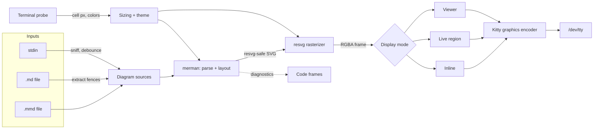
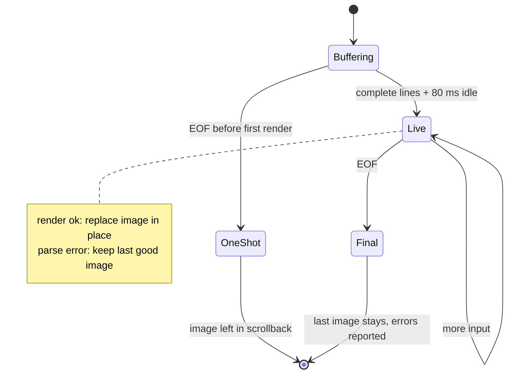
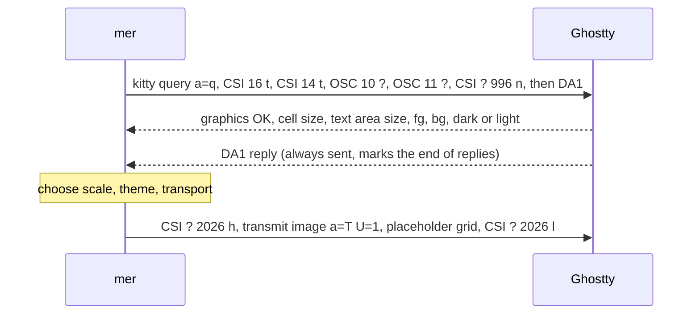

# mer — design proposal

> Status: draft · open questions resolved 2026-09-11 (§15)

`mer` renders Mermaid diagrams as real graphics inside the terminal, the way `viu` shows images:

```sh
mer flow.mmd              # inline, sized to the terminal
mer README.md             # every mermaid block in a Markdown file
cat flow.mmd | mer -      # stdin
mer -w flow.mmd           # live preview while you edit
mer -i big.mmd            # full-screen pan/zoom viewer
```

## 1. Decisions at a glance

| Area | Decision | Why |
|---|---|---|
| Language | Rust, single static binary | Your primary language; the best native Mermaid engine and SVG rasterizer are Rust crates |
| Mermaid engine | [merman](https://github.com/Latias94/merman), embedded | Output nearly identical to mermaid.js on our samples, ~12 ms, no browser (§3) |
| Rasterizer | resvg / tiny-skia | Pure Rust; renders merman's resvg-safe SVG; can render any viewport at any zoom |
| Font | Inter, embedded in the binary; labels measured with the same font | Identical output on every machine, including over SSH; no system font scan at start-up |
| Display | Kitty graphics protocol with Unicode placeholders | Ghostty implements the full protocol; placeholders make images behave like text and update in place |
| Transport | Shared memory locally, zlib + base64 over SSH | Ghostty supports all four transmission mediums (verified in source) |
| Sizing | "Text-matched" scale, snapped to whole cells, 1 image px = 1 screen px | Diagram labels come out the size of your terminal font, and crisp |
| Colors | Theme derived from the terminal's fg/bg/palette; follows light/dark switches | Diagrams look native in any color scheme |
| stdin | `-` reads stdin; keys and terminal replies go through `/dev/tty` | `cat f \| mer -` behaves exactly like `mer f`; pipes that stay open render live |
| Terminal detection | Probe features, never trust `$TERM_PROGRAM` | Works in Ghostty first, Kitty for free, degrades cleanly elsewhere |

## 2. Goals and non-goals

**Goals**

- `mer <file>` puts a crisp, correctly sized diagram on screen in ≤ 50 ms for typical diagrams.
- Fidelity close to mermaid.js across all Mermaid diagram types.
- Inputs: `.mmd`/`.mermaid`, Markdown (fenced `mermaid` blocks), stdin — including streams that stay open.
- Live modes: watch a file; follow a stream; interactive pan/zoom for large diagrams.
- Syntax errors reported as `file:line:col` with a code frame.
- Works over SSH and (later) inside tmux.

**Non-goals (v1)**

- Pixel-identical output to mermaid.js.
- Rendering the non-diagram parts of Markdown.
- Full experience on terminals without the Kitty graphics protocol (they get a best-effort text fallback).
- Windows (Ghostty doesn't run there).

## 3. Choosing the Mermaid engine

Mermaid.js measures text with a browser's layout engine, so the official CLI (`mmdc`) drives headless Chrome. For a tool that should feel as instant as `cat`, that is the central problem. The candidates were benchmarked on this machine (Apple Silicon, Ghostty 1.3.1) with four samples: a flowchart with a subgraph and several shapes, plus a sequence, a class and a state diagram. Output was compared visually against `mmdc`.

Whole-process wall time, median of 15 runs (includes process start-up):

| Engine | How it works | SVG | PNG | Output vs `mmdc` |
|---|---|---|---|---|
| `mmdc` 11.12 (mermaid-cli) | mermaid.js in headless Chrome | — | 1.2–1.7 s (2×) | Reference. Failed out of the box here (its pinned Chrome build was missing) until pointed at system Chrome. |
| mmdr 0.3.1 (`mermaid-rs-renderer`) | Independent Rust re-implementation | 3–4 ms (67 ms flowchart) | 16–87 ms (1×) | Wrong on common syntax. The chain `R --> X[label] --> P` rendered as a node literally named `X[Extract` and lost an edge. `Result~Svg~` generics weren't converted. Edge labels overlapped and edges were routed through nodes. |
| **merman 0.8.0-alpha.6** | Rust port validated against pinned mermaid@11.17.2 fixtures | 12–14 ms | 34–48 ms (2×) | Near-identical layout on all four (flowchart 930×2166 vs 970×2172 px; state 764×872 vs 766×872). One visible difference: class-relation markers (`o--`, `<\|..`) drawn filled instead of hollow. |

Also surveyed, not benchmarked:

- **beautiful-mermaid**: TypeScript, 6 diagram types, its own visual style; needs a JS runtime.
- **mmdflux, mermaid-text**: Rust, Unicode box-drawing output only.
- **mermaid-little**: claims byte-exact parity, but its source repository returns 404.
- **mdv, glowm**: Markdown viewers that shell out to `mmdc` for diagrams.

**Decision: embed merman.** Beyond the parity results, its library API fits this tool unusually well:

- `render_svg_resvg_safe_sync` emits SVG without `<foreignObject>`, so resvg can draw every label.
- A `TextMeasurer` trait lets us measure labels with the same font we rasterize with.
- `OperationControl` provides cooperative cancellation and deadlines. Live modes need this to drop stale renders.
- It also has raster budgets, a Unicode/ASCII renderer, and lint diagnostics with `line:col` and rule codes.
- It covers 35 diagram families, is Zed's Mermaid backend, and is actively developed (latest release 2026-09-02).

**Risks and mitigations**

- *Pre-1.0 API churn.* All merman calls live in `engine/merman.rs` behind an `Engine` trait, and the version is pinned exactly. Golden-image tests gate upgrades.
- *MSRV 1.95.* Your default stable toolchain is 1.94.0 (1.98.1 is current). A `rust-toolchain.toml` pins the version, and rustup installs it on first build.
- *Remaining parity gaps.* Report them upstream with fixtures. As an escape hatch, `--engine mmdc` shells out to mermaid-cli when it is installed.

## 4. Architecture



One crate, no async runtime. Threads:

- **main** owns `/dev/tty`: probing, key/mouse/resize events, all terminal output.
- **render worker** takes jobs from a newest-wins slot. A newer job cancels the in-flight merman render. Also rasterizes.
- **stdin reader** runs only for `-`. **watcher** runs only for `-w`.

```text
src/
  main.rs              CLI (clap), mode dispatch, exit codes
  input/
    mod.rs             DiagramSource, Origin, content sniffing
    markdown.rs        fence extraction with line offsets (pulldown-cmark)
    stream.rs          stdin chunking, NUL document boundaries, debounce
  engine/
    mod.rs             Engine trait, RenderOptions, Diagnostic
    merman.rs          the only file that touches merman
    mmdc.rs            optional mermaid-cli escape hatch
  raster.rs            usvg + resvg into a pixmap; viewport transforms; pixel budget
  theme.rs             terminal colors -> Mermaid themeVariables
  term/
    tty.rs             /dev/tty, raw-mode guard, restore on exit/panic/signal
    probe.rs           one-round-trip capability probe (§7.1)
    kitty.rs           transmit / place / delete, chunking, shm + temp-file transport
    placeholder.rs     U+10EEEE grid writer
    tmux.rs            passthrough wrapping
  view/
    inline.rs          one-shot print
    live.rs            in-place updating region (watch + streaming stdin)
    viewer.rs          alt-screen pan/zoom
  diag.rs              code frames
  config.rs            ~/.config/mer/config.toml
```

Core types, roughly:

```rust
pub struct DiagramSource {
    pub text: String,
    pub origin: Origin,          // File { path, first_line } | Stdin { doc_index }
    pub caption: Option<String>, // nearest preceding Markdown heading
}

pub trait Engine: Send + Sync {
    fn render(&self, src: &DiagramSource, opts: &RenderOptions, cancel: &Cancel)
        -> Result<Svg, Vec<Diagnostic>>;
}

/// Rasterized and already padded to whole cells.
pub struct Frame {
    pub rgba: Vec<u8>,           // straight (non-premultiplied) RGBA8
    pub px: (u32, u32),
    pub cells: (u16, u16),
}
```

## 5. Input

### 5.1 Files and Markdown

- `.mmd` / `.mermaid`: one diagram.
- `.md` / `.markdown` / `.mdx`: every `mermaid` fence (backtick or tilde) in document order. `-n N` selects one. The nearest preceding heading becomes the caption. Line numbers are kept so diagnostics point into the Markdown file.
- Anything else is sniffed like stdin.
- Several inputs are shown in order; the viewer navigates across all of them.

### 5.2 stdin and streaming

`mer -` reads stdin. With no `INPUT` and a non-terminal stdin, `mer` reads stdin implicitly.

**Terminal I/O never touches stdin.** Keyboard input and replies to terminal queries are read from `/dev/tty`, so the viewer and keys still work when stdin is a pipe. crossterm already opens `/dev/tty` when stdin isn't a TTY (checked in its `tty_fd()`), and the probe does the same. If there is no controlling terminal, only `-o` and `--check` work.

**Sniffing (automatic).** One rule covers stdin and files with unknown extensions. The format is decided at the first meaningful line, skipping blank lines, `%%` comments and a leading `---` frontmatter block (Markdown documents often start with frontmatter too):

- A Mermaid diagram header (`flowchart LR`, `sequenceDiagram`, `pie title …`) or a `%%{init}%%` directive → **Mermaid**. The line must match the diagram's header syntax, not just its first word, so prose such as "pie charts are…" doesn't count.
- Anything else (a heading, prose, a list, a fence) → **Markdown**: each `mermaid` fence renders when it closes.
- Markdown input that ends without a `mermaid` fence exits 1 with "no Mermaid diagram found".
- `--stdin-format mermaid|markdown` overrides detection for the rare ambiguous input.

**One rule for streams:** show the newest input that renders successfully, and never flash errors while input is still arriving.

| Stream | Behavior |
|---|---|
| Closes quickly (`cat f \| mer -`) | Identical to `mer f`: read to EOF, render once inline, exit. |
| Stays open, Mermaid text (a generator, `tail -f`, an LLM) | Once complete lines have arrived and input has been idle for 80 ms, render. Success replaces the image in place. A parse error keeps the last good image and shows a dim "waiting for input…" status. At EOF the final render happens; errors are reported only then, and the exit code reflects the final state. |
| Stays open, Markdown | Each `mermaid` fence renders as soon as its closing fence arrives, stacked in order. |
| Several documents | A NUL byte (as in `find -print0`) ends a document. The next one replaces the live image; `--append` stacks them instead. |



No flag is needed to choose between one-shot and live: both use the same inline region (§8.2). A slow producer simply shows its first frame a little earlier.

Guard rails:

- A size cap defaults to Mermaid's `maxTextSize` (50 000 characters).
- Renders are capped at about 30 per second.
- If stdout is not a terminal and there's no `-o`, `mer` exits with an error, because escape sequences in a pipe are useless. `--protocol kitty` forces output anyway.

**Later (not v1):** `--tee` would also pass through the non-diagram text of a Markdown stream, turning `llm … | mer - --tee` into a chat transcript with rendered diagrams.

### 5.3 Watch (`-w`)

- Uses `notify` with a debouncer, watching the parent directory so atomic-rename saves (vim, most editors) are caught.
- Same live-region behavior as streams. A saved file counts as complete, so errors show immediately under the last good image.
- For Markdown, only fences whose content hash changed are re-rendered.
- `-w` with `-` is rejected; streams are already live.

## 6. Rendering

### 6.1 Engine adapter

- SVG comes from merman's resvg-safe pipeline.
- Config precedence: diagram frontmatter / `%%{init}%%` › `-c` config file › `mer` defaults (theme, font).
- No network access. merman's remote icon packs and images stay disabled.
- **Font (decided): Inter, embedded.** Static Inter 4.1 faces (Regular, Italic, Bold, BoldItalic; SIL OFL 1.1) are compiled into the binary and are the only fonts loaded at start-up. `mer` passes `Inter` to merman as `fontFamily` and implements merman's `TextMeasurer` trait (`measure(text, &TextStyle) -> TextMetrics`, where `TextStyle` carries family, size, weight and style) with rustybuzz on the same faces. Layout boxes therefore match the rasterized glyphs exactly on every machine, including over SSH to hosts without Mermaid's default `trebuchet ms`.
- A diagram or config that sets its own `fontFamily` still wins; `--font` changes the default.
- System fonts are scanned only for glyphs Inter lacks (CJK, emoji), and the measurer uses the same fallback chain.

### 6.2 Sizing: text-matched scale

Diagram text should match the size of the terminal's own text. Diagrams shrink to fit when necessary and are never blown up past that size.

1. Probe the cell size in device pixels with `CSI 16 t` (reply `CSI 6 ; h ; w t`); fall back to `TIOCGWINSZ` pixel fields. Ghostty provides both.
2. Base scale `s₀ = cell_h / (1.3 × 16)`, where 16 px is Mermaid's label size and 1.3 is a typical monospace line height (tunable). For a 13 pt font on a Retina display (≈34 px cells), `s₀ ≈ 1.6`.
3. Target size = SVG natural size × `s₀` × `--scale`, then fit:
   - **inline one-shot**: fit to terminal width; height may exceed the screen and scroll, like viu. The viewer never opens on its own.
   - **live modes**: also fit to screen height minus the status line, so the region never scrolls away.
   - If fitting makes text smaller than half its text-matched size, print a one-line hint to use `mer -i`.
4. Snap to whole cells: `cols = ⌈w / cell_w⌉`, `rows = ⌈h / cell_h⌉`. Rasterize directly into a transparent pixmap of `cols·cell_w × rows·cell_h`. The terminal never resamples.
5. Pixel budget: inline frames are capped at 16 MP. The viewer renders only the viewport. Ghostty's `image-storage-limit` defaults to 320 MB per screen.

### 6.3 Theme

The default theme is `terminal` when displaying and Mermaid's `default` when exporting with `-o`. The terminal theme queries fg/bg (`OSC 10/11`) and a few palette entries (`OSC 4`), then fills Mermaid's `base` theme:

| Mermaid variable | Derived from |
|---|---|
| `darkMode` | luminance(bg) < 0.5 |
| `background` | bg (the image itself stays transparent) |
| `primaryColor` / `primaryBorderColor` | mix(bg, blue, 20%) / mix(bg, blue, 70%) |
| `primaryTextColor`, `textColor` | fg |
| `lineColor` | mix(bg, fg, 65%) |
| `secondaryColor` / `tertiaryColor` | mix(bg, magenta, 20%) / mix(bg, fg, 8%) |
| `clusterBkg` / `clusterBorder` | mix(bg, fg, 5%) / mix(bg, fg, 30%) |
| `noteBkgColor` / `noteTextColor` | mix(bg, yellow, 25%) / fg |
| `edgeLabelBackground` | bg, opaque so labels stay legible over lines |

- Live modes enable color-scheme reports (`CSI ? 2031 h`). When `CSI ? 997 ; 1|2 n` arrives, they re-query the colors and re-render.
- A theme set inside the diagram always wins, since that is the author's intent.
- `-t` selects any merman built-in theme: default, base, dark, forest, neutral, neo, neo-dark, redux….

### 6.4 Rasterization

- Parse with `usvg` using a shared font database.
- Scanning system fonts is a known fixed cost (mmdr ships a `--fastText` mode to avoid it). Load the embedded font first and scan system fonts only when a label needs glyphs it lacks.
- `resvg::render` with a scale-and-translate transform draws exactly the requested viewport at any zoom, with no full-size intermediate. The viewer depends on this.
- tiny-skia pixmaps are premultiplied; demultiply before sending raw RGBA (`f=32`).

## 7. Terminal layer

### 7.1 Capability probe

At start-up, `mer` writes all queries at once to `/dev/tty` in raw mode, followed by DA1. Every terminal answers DA1, so there's no timeout to wait out. Anything that arrives before the DA1 reply is a supported feature; a 500 ms safety timeout covers broken multiplexers.



Environment variables (`TERM_PROGRAM`, `SSH_CONNECTION`, `TMUX`) only pick defaults, such as the transport; they never override the probe. `mer --doctor` prints what was detected.

### 7.2 Kitty graphics usage

**Placement: virtual placements plus Unicode placeholders.** `mer` transmits with `a=T,U=1,i=<id>,c=<cols>,r=<rows>`, then prints a `rows × cols` grid of `U+10EEEE`. Each cell carries row/column diacritics, and the image id is encoded in the 24-bit foreground color. Compared with classic cursor placements:

- To the terminal the image is text: it scrolls, sits in scrollback, is erased by `clear`, and a tall image scrolls the screen like tall output would. No pre-scrolling tricks.
- To update in place, re-send the pixels with `a=T,U=1` under the same id. The placeholder grid doesn't change unless the size does.
- It keeps working inside tmux, which doesn't track image positions.
- Ghostty implements it (`graphics_unicode.zig`), as does Kitty.

Image ids are random 24-bit values, so they don't collide with other programs' images.

**Transport**, chosen per session:

| Situation | Medium | Payload |
|---|---|---|
| Local (default) | `t=s` POSIX shared memory; Ghostty unlinks it after reading | raw RGBA — no encoding, no base64 |
| Local, shm refused | `t=t` temp file in the temp dir with `tty-graphics-protocol` in its name; Ghostty deletes it after reading | raw RGBA |
| SSH / unknown | `t=d` direct | zlib RGBA (`o=z`), base64, 4096-byte chunks (`m=1` … `m=0`) |

- Normally every command uses `q=2` to suppress replies.
- The first transmit of a session uses `q=1` so an error reply (e.g. shm refused) switches to the next medium.
- On exit, the viewer deletes its images (`a=d,d=I`); inline images are left in scrollback.

### 7.3 Terminal features used (all present in Ghostty 1.3.1)

| Feature | Sequence | Used for |
|---|---|---|
| Kitty graphics: d/f/t/s mediums, RGB/RGBA/PNG, zlib | `ESC _G … ESC \` | Frames |
| Unicode placeholders | `U+10EEEE` + diacritics | Inline and live images; tmux |
| Synchronized output | `CSI ? 2026 h` / `l` | Tear-free updates |
| Pixel sizes | `CSI 16 t`, `CSI 14 t`, `TIOCGWINSZ` | Text-matched sizing |
| In-band resize reports | `CSI ? 2048 h` | Re-fit on resize, with pixel sizes, even over SSH |
| Color queries | `OSC 10 / 11 / 4 ; ?` | `terminal` theme |
| Color-scheme reports | `CSI ? 996 n`, `CSI ? 2031 h` | Re-theme on light/dark switch |
| SGR pixel mouse | `CSI ? 1016 h` (with 1003/1006) | Zoom about the exact pointer position, drag to pan |
| Pointer shape | `OSC 22 ; grab ST` | Grab/grabbing cursor while panning |
| Kitty keyboard protocol | `CSI > 1 u` | Unambiguous keys in the viewer |

Every mode `mer` enables is restored on exit, panic (via a panic hook) and SIGINT/SIGTERM.

### 7.4 SSH and tmux

- **SSH**: everything is in-band. The probe detects that shm is unavailable (or `SSH_CONNECTION` suggests it) and uses direct transmission.
- **tmux** (milestone 4):
  - Wrap graphics commands in `ESC Ptmux; … ESC \` with doubled ESCs.
  - Requires `set -g allow-passthrough on`; `mer` prints that hint when the probe fails inside tmux.
  - Placeholders are mandatory in tmux.

### 7.5 No graphics support

- Fall back to merman's Unicode renderer where it supports the diagram type. In testing it declined our state diagram, so this is best-effort.
- Otherwise print a one-line notice suggesting `-o diagram.png`.
- `--protocol text` forces this fallback.

## 8. Display modes

### 8.1 Inline (default)

1. Probe, size, render, rasterize.
2. For Markdown, print the caption dimmed.
3. Transmit the image, print the placeholder grid, then a newline.
4. Repeat for each diagram. A diagram that fails prints its code frame in place, and the others still render.
5. Exit with 0, or 1 if any diagram failed. Images remain in scrollback.

Known limitation: shrinking the terminal narrower than an old image re-wraps its placeholder rows, as it would for any wide text.

### 8.2 Live region (watch and open streams)

- The first frame is printed exactly as inline, followed by a status line such as `flow.mmd · flowchart · 13 ms · watching`, or an error summary with `line:col`.
- Updates run inside synchronized output. Same size: re-send pixels only. New size: move to the region start, clear to the end of the screen (`CSI J`), and redraw the grid and status line. Live mode controls all output, so the region start is always known.
- Keys (from `/dev/tty`): `q` quit (last frame stays), `r` re-render, `i` open the viewer, `t` cycle theme.

### 8.3 Interactive viewer (`-i`)

- Alt screen with the cursor hidden; pixel mouse, kitty keyboard and synchronized output enabled.
- View state: `zoom` (1.0 = text-matched), `center` in diagram coordinates, `index` of the diagram.
- Every change renders only the visible viewport at the current zoom, so the image is always crisp and the cost is bounded by screen size, not diagram size.
- Over SSH, the existing image is shown immediately with a cheap source-rectangle crop (`x,y,w,h`) or cell scaling. A sharp re-render follows once input has been idle for 100 ms.
- Bottom status bar: `README.md [2/5] · sequence · 140% · 9 ms`.

| Keys | Action |
|---|---|
| `h j k l` / arrows (Shift = faster), mouse drag | Pan |
| `+` `-`, scroll wheel (about the pointer) | Zoom |
| `0` / `1` / `w` | Fit all / text-matched 100% / fit width |
| `n` `p` / `g` `G` | Next, previous / first, last diagram |
| `t` / `b` | Cycle theme / toggle background |
| `s` / `y` | Save PNG + SVG to the current directory / copy Mermaid source (OSC 52) |
| `r` / `?` / `q` `Esc` | Reload / help / quit |

## 9. Diagnostics

merman reports parse errors with position, severity and rule code. Output from the spike:

```text
broken.mmd:3:15: error merman.parse.diagram_parse: Unterminated node label (missing `]`)
```

`mer` turns that into a code frame on stderr. For Markdown, positions are shifted from fence-relative to file-relative:

```text
error[parse]: unterminated node label (missing `]`)
  --> docs/arch.md:44:15
   |
44 |   B -->|yes| C[Done
   |               ^
```

`mer --check FILES…` parses and lays out every diagram without displaying anything, and exits 1 on errors. It is meant for pre-commit hooks and CI.

## 10. CLI

```text
mer [OPTIONS] [INPUT]...

Arguments:
  [INPUT]...                Mermaid or Markdown file(s); "-" reads stdin
                            (stdin is read implicitly when it is not a terminal)
Modes:
  -w, --watch               Re-render when INPUT changes
  -i, --interactive         Full-screen pan/zoom viewer
      --check               Parse + layout only; report diagnostics; exit 1 on errors
Selection:
  -n, --diagram <N>         Only the Nth mermaid block of a Markdown input
      --stdin-format <F>    auto | mermaid | markdown                 [default: auto]
      --append              Streams: stack documents instead of replacing
Appearance:
  -t, --theme <NAME>        terminal | default | dark | forest | neutral | base | neo | …
  -b, --background <COLOR>  transparent | terminal | CSS color         [default: transparent]
  -c, --config <FILE>       Mermaid config (JSON/YAML), as with mmdc -c
  -s, --scale <X>           Relative to text-matched size              [default: 1.0]
      --fit <MODE>          auto | width | contain | none              [default: auto]
      --font <NAME|PATH>    Label font                                 [default: embedded]
Output:
  -o, --output <FILE>       Write PNG/SVG instead of displaying ("-" = stdout)
      --format <F>          png | svg | unicode              [default: from -o extension]
      --protocol <P>        auto | kitty | text                        [default: auto]
      --engine <E>          merman | mmdc                              [default: merman]
      --doctor              Print detected terminal capabilities and engine info
```

Exit codes: `0` success · `1` diagram error(s) · `2` usage, I/O or terminal error.

Configuration lives at `$XDG_CONFIG_HOME/mer/config.toml`. Precedence is flags › config file › defaults; in-diagram directives override per diagram.

```toml
theme = "terminal"
background = "transparent"
font = "embedded"

[mermaid]                 # passed through as Mermaid config
flowchart.curve = "basis"

[viewer]
zoom_step = 1.25
```

## 11. Performance targets

Measured with merman's own CLI (whole process, including PNG encoding that `mer` skips on the shm path): 12–14 ms per SVG, 34–48 ms per 2× PNG.

| Scenario (Apple Silicon, local Ghostty) | Target |
|---|---|
| `mer small.mmd`, process start → image visible | p50 ≤ 50 ms |
| Live update after a save or new stream data, ≤ 100 nodes | ≤ 50 ms |
| Viewer re-render of a full-screen viewport | ≤ 33 ms |

No render cache in v1; renders are fast enough without one. A cache would only help `--engine mmdc`.

## 12. Dependencies and packaging

| Crate | Purpose |
|---|---|
| `merman` (feature `render`), pinned `=0.8.0-alpha.6` | parse, layout, SVG |
| `resvg`, `usvg`, `tiny-skia`, `fontdb` | rasterization |
| `crossterm` | raw mode and events via `/dev/tty` |
| `rustix` | `shm_open`/`mmap`, termios, `TIOCGWINSZ` for the probe |
| `clap` (derive) | CLI |
| `notify`, `notify-debouncer-full` | watch mode |
| `base64`, `flate2` | direct transmission |
| `pulldown-cmark` | Markdown fence extraction with offsets |
| `annotate-snippets` | code frames |
| `serde`, `toml`, `serde_json` | configuration |
| `rustybuzz` | `TextMeasurer` on the embedded font |

- Edition 2024; `rust-toolchain.toml` pins `1.98`.
- Fonts: Inter 4.1 static TTFs — Regular, Italic, Bold, BoldItalic (≈ 1.7 MB) — in `assets/fonts/`, embedded with `include_bytes!`. Inter is SIL OFL 1.1; the license text ships in the repo and in release archives.
- The name `mer` is taken on crates.io (an ELF parser), so publish as **`mer-cli`** (available) with `[[bin]] name = "mer"`.
- Homebrew has no `mer` formula, so a tap can use the plain name.

## 13. Testing

- **Unit.** Kitty encoder as byte-exact golden strings: chunk boundaries, `m=` flags, tmux wrapping, placeholder diacritics. Sizing properties (never wider than the terminal, whole cells). Theme color math. Fence extraction (CRLF, `~~~`, indented and nested fences). Stream chunker (UTF-8 split across reads, NUL boundaries, debounce).
- **Probe.** A scripted fake terminal on a PTY pair that answers some queries and ignores others. Covers the DA1 sentinel and the timeout path.
- **Golden images.** A corpus of Mermaid documentation examples for every diagram type, rendered at a fixed scale and theme and compared with a perceptual-diff threshold. This is what makes merman upgrades safe. Because the font is embedded, goldens are identical on macOS and Linux CI; labels that need system fallback glyphs (CJK, emoji) get separate smoke tests.
- **Parity sheet** (manual, not a CI gate). The same corpus rendered by `mmdc` beside `mer`, on an HTML contact sheet.
- **End-to-end.** Run `mer` under a PTY and assert on the escape stream: image transmitted, grid emitted, synchronized-output markers balanced, terminal state restored.
- **Manual Ghostty checklist.** Scrollback, resize, light/dark switch, SSH, tmux.

## 14. Milestones

| Milestone | Scope | Exit criteria |
|---|---|---|
| **M0 spike** (≤ 1 day) | Hard-wired `.mmd` → merman → resvg with embedded Inter → `a=T,U=1` placeholder grid in Ghostty | Pixel-crisp at text-matched scale on Retina; ≤ 50 ms end-to-end; measure how far merman's built-in text measurer is off for Inter |
| **M1 MVP** | CLI, files, `-` stdin to EOF, format sniffing, Markdown, probe, terminal theme, embedded font + `TextMeasurer`, fit rules, `-o png/svg`, diagnostics, `--check` | `mer` works for everyday files and pipes |
| **M2 live** | Open-stream rendering, `-w`, live region and status line, light/dark re-theme, shm transport | Editor split + `mer -w` feels instant; streaming LLM output renders progressively |
| **M3 viewer** | `-i` pan/zoom, mouse, multi-diagram navigation | Large diagrams comfortably explorable |
| **M4 polish** | tmux, SSH tuning, Unicode fallback, `--engine mmdc`, config file, Homebrew tap | Release 0.1 |
| **Later** | `--tee` for Markdown streams, font subsetting | — |

## 15. Decisions

Resolved 2026-09-11:

| # | Question | Decision |
|---|---|---|
| 1 | Tall diagrams inline | Scroll like viu; the viewer opens only with `-i` |
| 2 | Default font | Embed Inter; `--font` overrides (§6.1) |
| 3 | Markdown on stdin | Detect automatically (§5.2); `--stdin-format` is only an override |
| 4 | `--tee` for Markdown streams | Later, not v1 |

## Appendix: alternatives not chosen

- **mermaid-cli / headless Chromium as the main engine.** 1.2–1.7 s per render, a Node + Chrome dependency, and it broke locally on Chrome version pinning. Kept only as `--engine mmdc`.
- **A native WebView (WKWebView / WebKitGTK) running mermaid.js.** Exact parity, but platform-specific code, main-thread run-loop constraints, and still a browser engine per run.
- **mmdr.** Fastest, but produced incorrect output for common syntax in our samples.
- **Bun/Deno binary with beautiful-mermaid.** Six diagram types, and its own style rather than Mermaid's.
- **ratatui + ratatui-image for the viewer.** A good general image widget, but `mer` needs placeholder grids, shm transport, viewport re-rendering and newest-wins scheduling. A small purpose-built Kitty module is simpler than adapting it.
- **Mermaid's system font stack (`trebuchet ms`, verdana, arial).** Matches mermaid.js on macOS, but output changes from machine to machine, including over SSH to Linux hosts. An embedded font was chosen instead.
- **Half-block (`▀`) pixel fallback.** Labels are illegible at that resolution; the Unicode diagram renderer is a better fallback.
