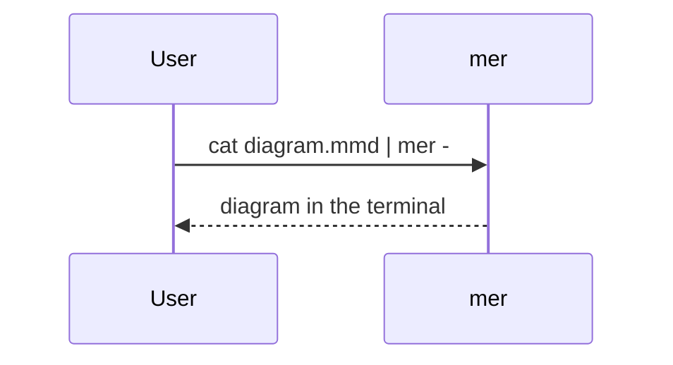
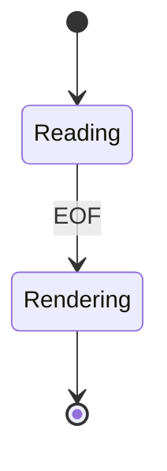

# Design notes

Some prose before the diagrams.

## Request flow

```mermaid
sequenceDiagram
    participant U as User
    participant M as mer
    U->>M: cat diagram.mmd | mer -
    M-->>U: diagram in the terminal
```

A paragraph between the diagrams.

## States

```mermaid
stateDiagram-v2
    [*] --> Reading
    Reading --> Rendering: EOF
    Rendering --> [*]
```
