# Gallery

One diagram of each type, for checking themes by eye.

## Flowchart

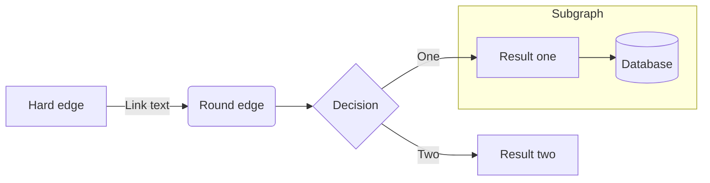

## Sequence

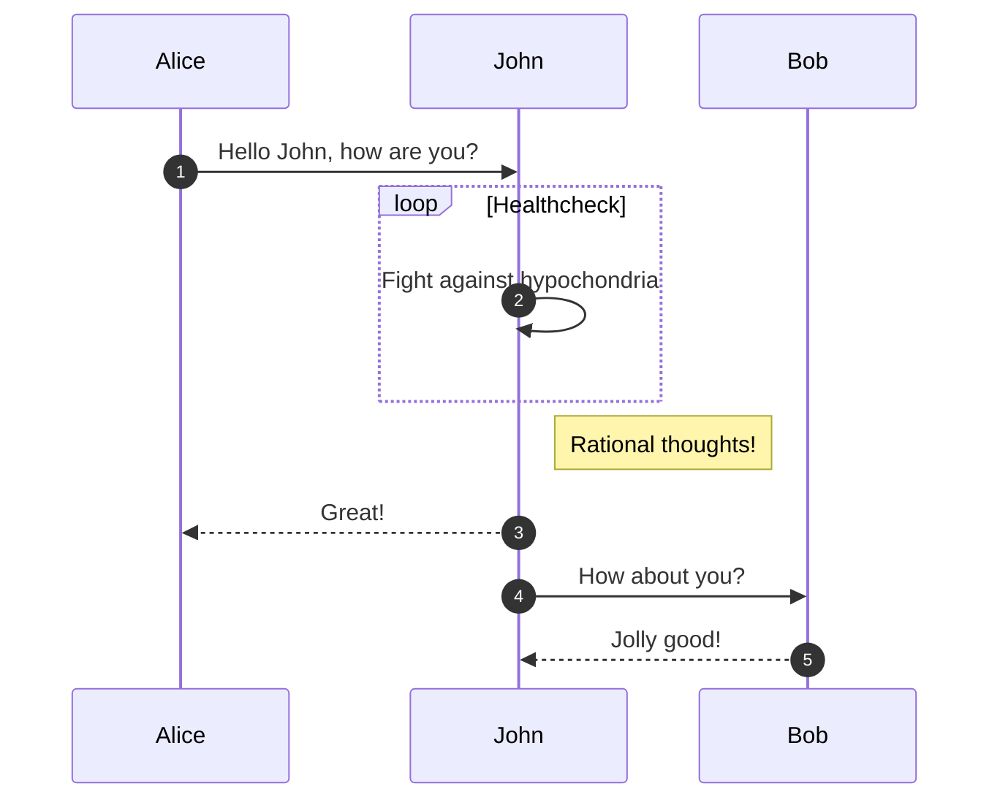

## Class

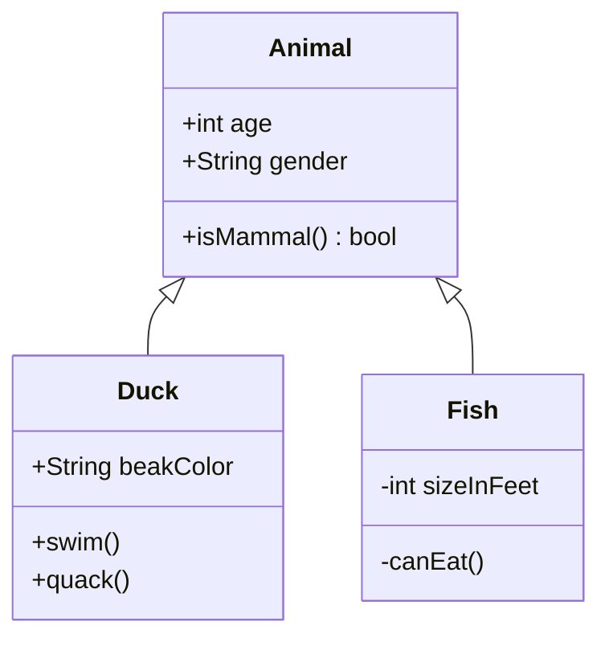

## State

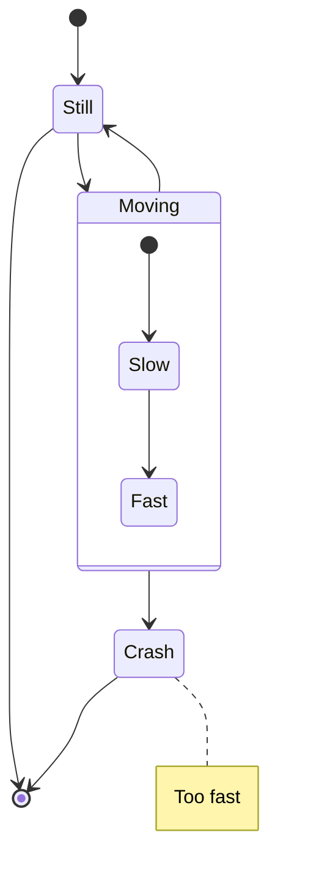

## Entity relationship

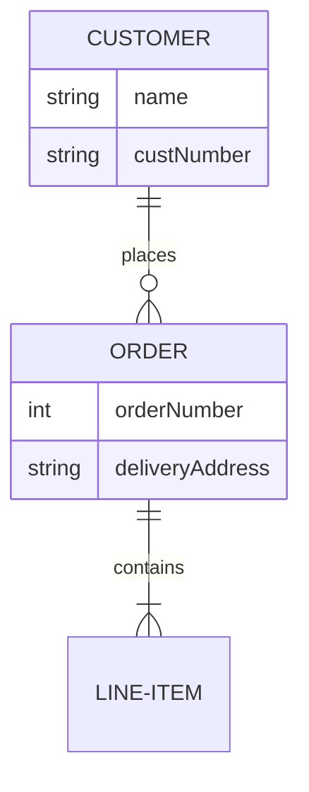

## Gantt

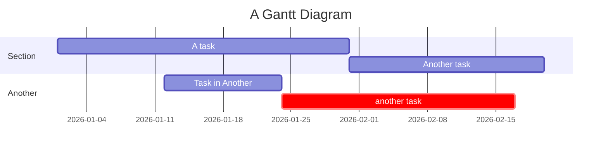

## Pie

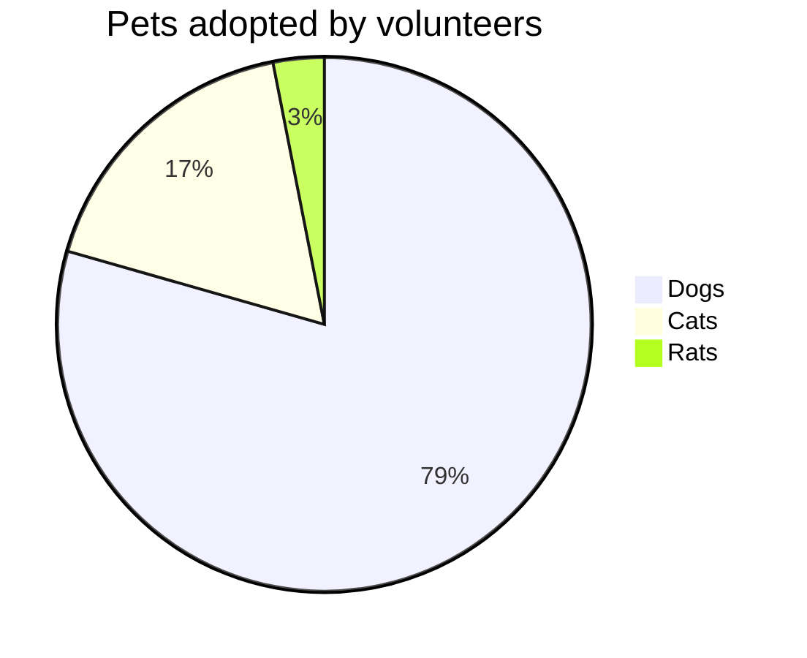

## User journey

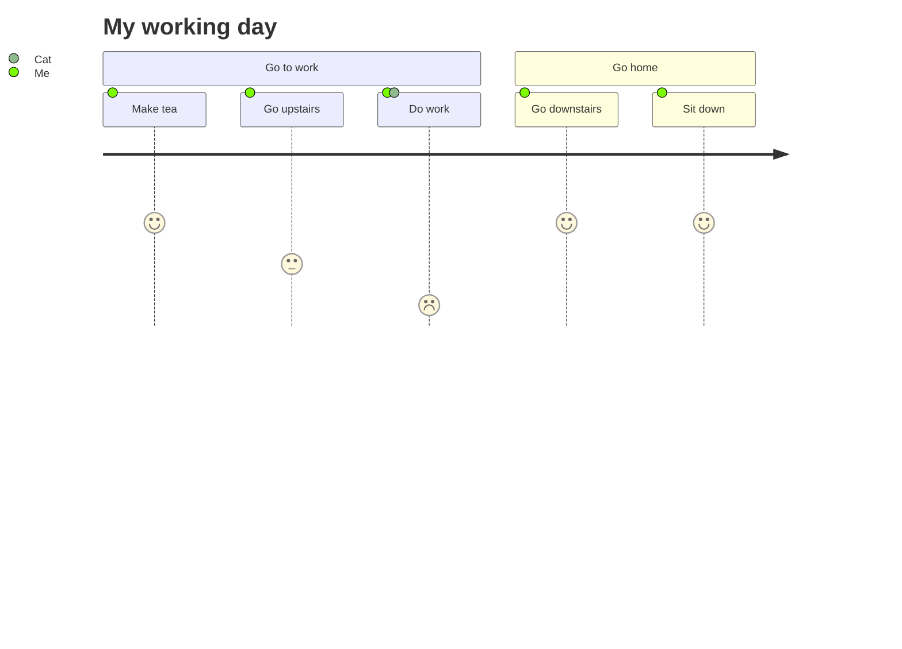

## Git graph

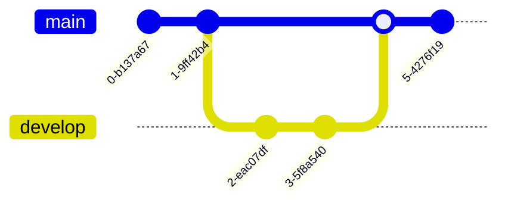

## Mindmap

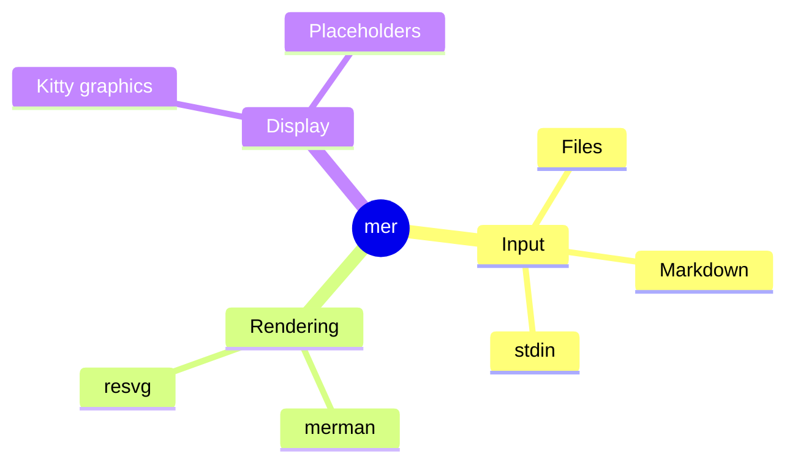

## Timeline

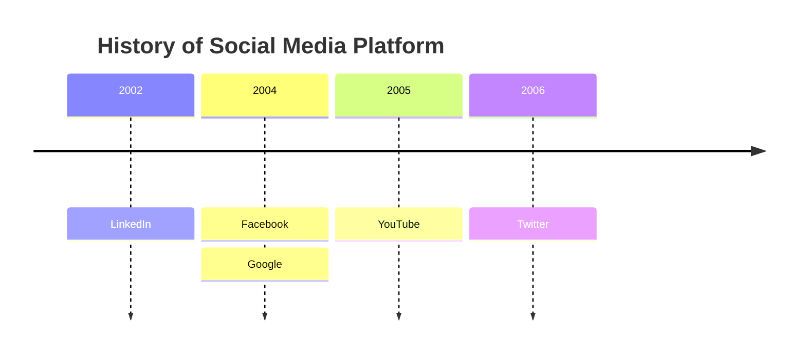

## Quadrant

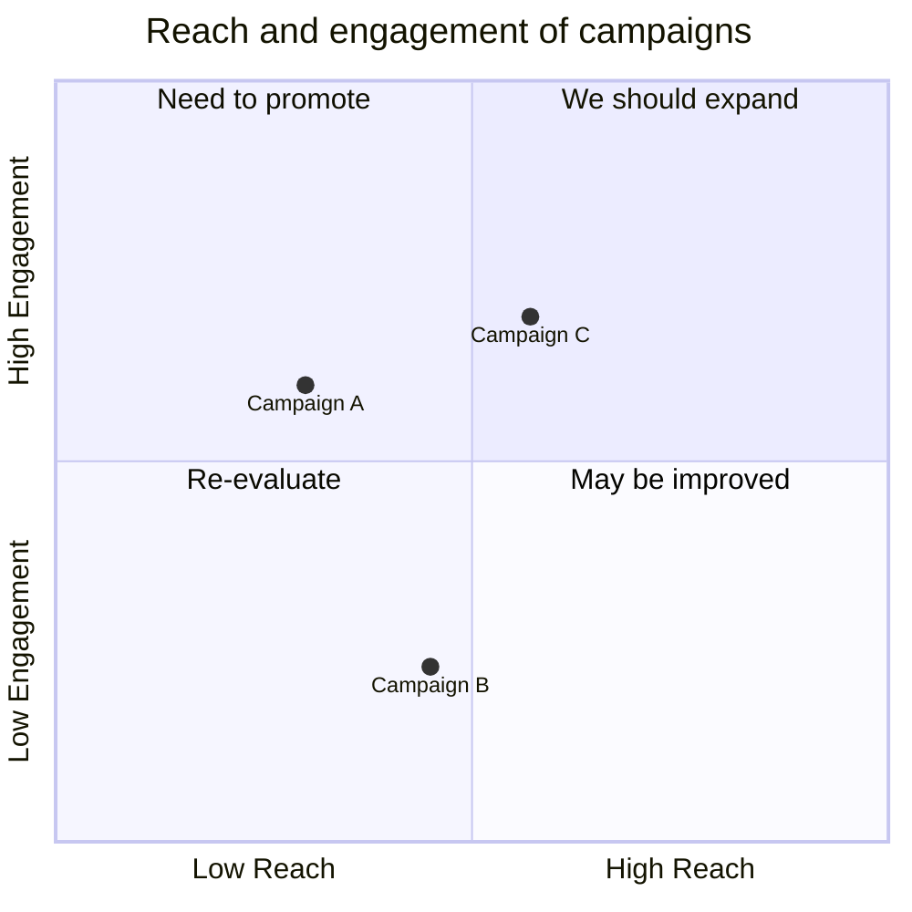

## XY chart

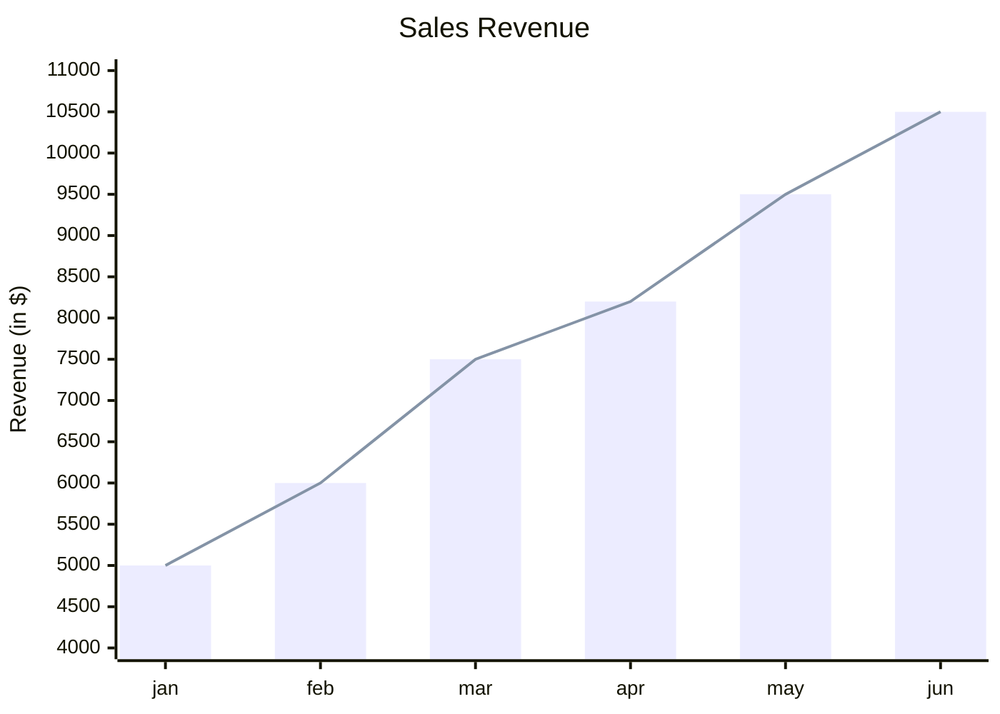

## Sankey

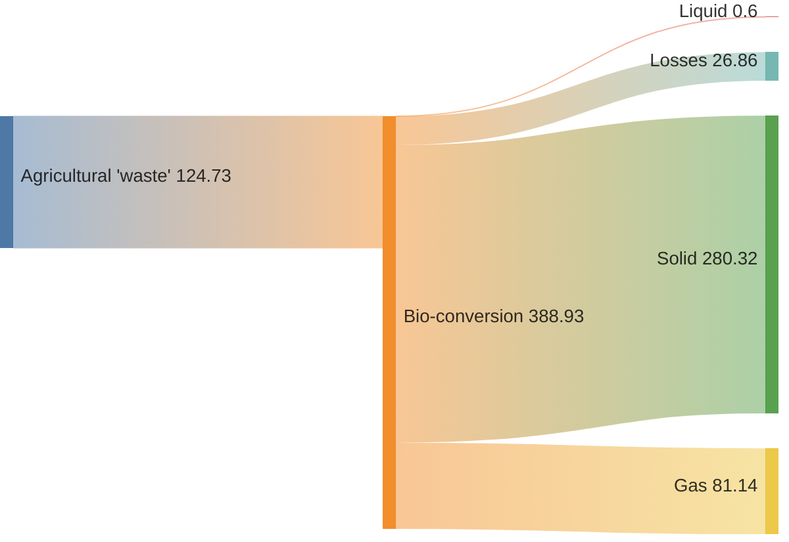

## Requirement

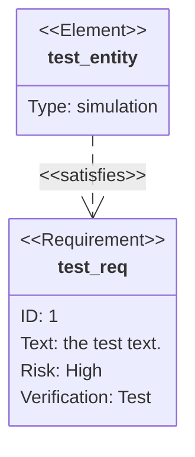

## C4

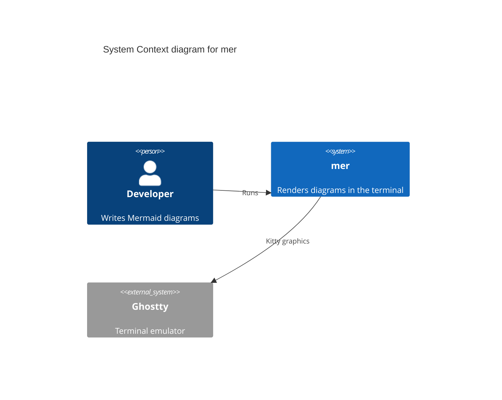

## Block

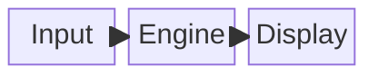

## Packet

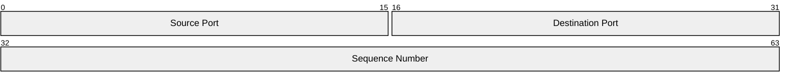

## Kanban

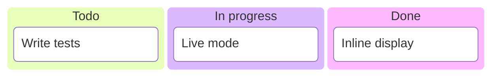

## Architecture

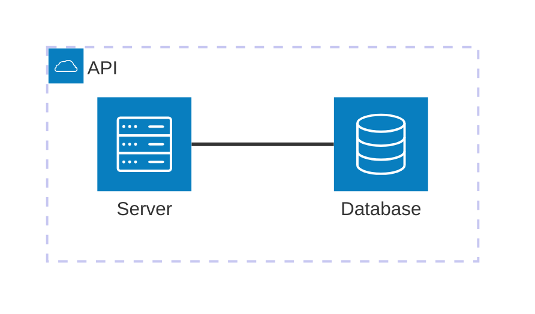

## Radar

```mermaid
radar-beta
  title Skills
  axis a["Speed"], b["Fidelity"], c["Ease"]
  curve m["mer"]{4, 5, 4}
  curve c["mmdc"]{1, 5, 3}
  max 5
```

## Treemap

```mermaid
treemap-beta
"Section 1"
    "Leaf 1.1": 12
    "Section 1.2"
      "Leaf 1.2.1": 12
"Section 2"
    "Leaf 2.1": 20
    "Leaf 2.2": 25
```
